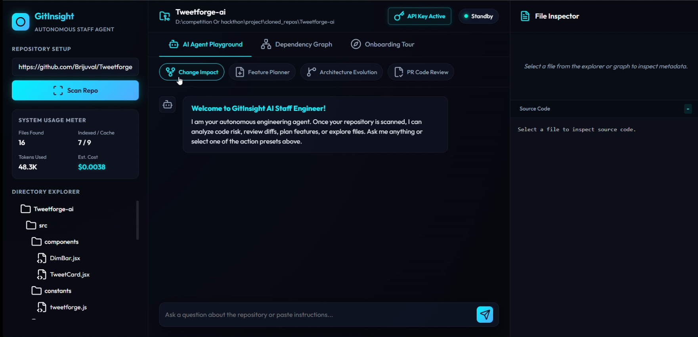
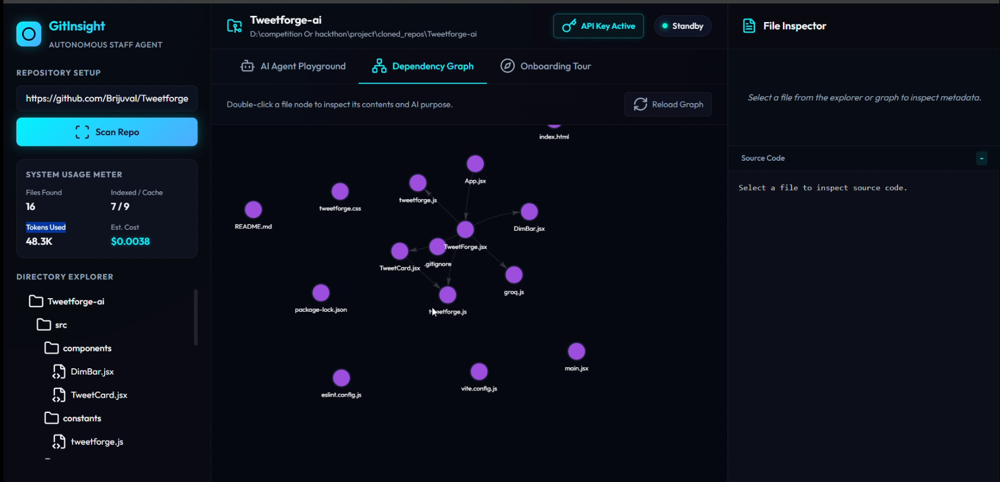
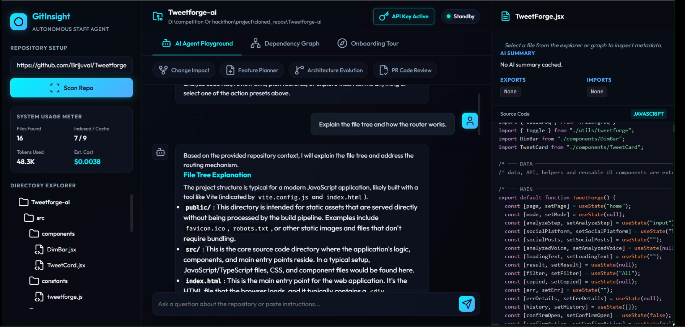
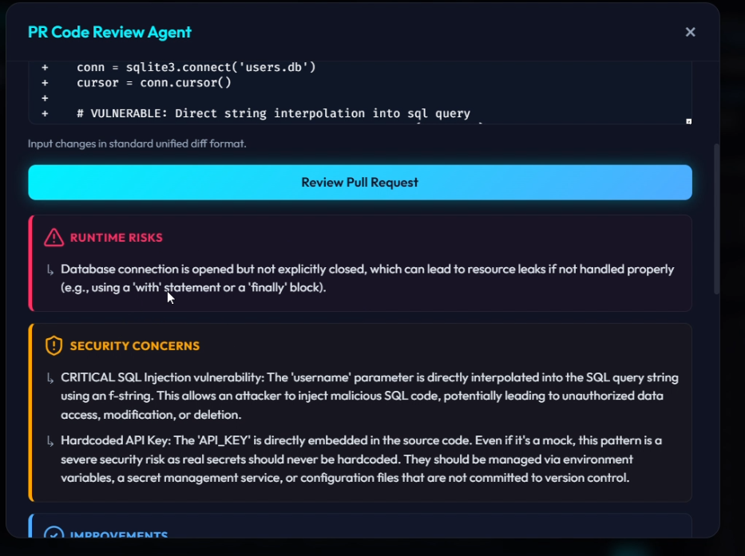
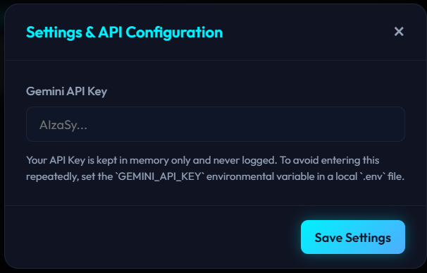
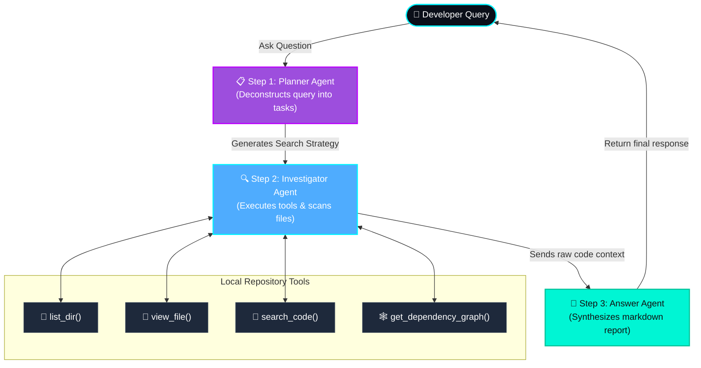

# GitInsight: Autonomous Engineering Agent

<p align="center">
  
  
</p>
<p align="center">
  
  
</p>
<p align="center">
  <sub><i>Offline setup warning state:</i></sub><br/>
  
</p>


**GitInsight** is an AI-powered Codebase Intelligence Platform and Autonomous Engineering Agent that acts as an AI Staff Engineer for your repositories. Going far beyond standard RAG systems, GitInsight maps repo structures and AST dependency graphs, predicts change impacts, generates dev onboarding tours, designs implementation steps for features, reviews code diffs, and coordinates tasks using a multi-agent orchestration pattern.


Built with Google Gemini models using the official `google-genai` SDK, GitInsight is designed for the **Freestyle Track** or **Agents for Business** track of the Kaggle 5-Day AI Agents Capstone Project.

---

## ⚡ Quick Start Roadmap (60-Second Setup)

Follow these 4 steps to run the platform locally from your terminal:

```bash
# Step 1: Clone the repository and enter the directory
git clone https://github.com/Brijuval/GitInsight-AI.git
cd GitInsight-AI

# Step 2: Create and activate virtual environment (using uv or python)
python -m venv .venv
# On Windows (PowerShell):
.venv\Scripts\activate
# On macOS/Linux:
source .venv/bin/activate

# Step 3: Install all backend dependencies
pip install -r requirements.txt

# Step 4: Run the server!
python -m uvicorn main:app --host 127.0.0.1 --port 8000
```
Open **[http://localhost:8000](http://localhost:8000)** in your browser.

---

## 📖 Step-by-Step Testing Walkthrough

Here is exactly how to test and verify every feature once the app is open:

### 1. Set Your Gemini API Key
*   **How:** In the top-right corner of the dashboard, you will see a pulsing amber button that says **Set API Key**. Click it, paste your Gemini API key (starts with `AIzaSy...`), and click **Save Settings**.
*   **Result:** The button turns solid cyan and reads **API Key Active**, indicating the server is ready.
*   *(Optional: You can create a `.env` file in the root folder containing `GEMINI_API_KEY=your_key` to load it automatically).*

### 2. Scan and Index a Repository (Local or Remote URL)
*   **Option A (Local Repo):** Enter `.` in the repository input box and click **Scan Repo** to scan GitInsight itself.
*   **Option B (Remote GitHub Repo):** Paste a public GitHub HTTPS URL (like `https://github.com/Brijuval/Tweetforge-ai.git`) and click **Scan Repo**. The backend will automatically clone and index it on the server.
*   *Observe:* 
    *   The **Directory Explorer** sidebar populates with folders and custom icons.
    *   The **System Usage Meter** shows total files found, token count, and exact USD query costs.

### 3. Explore the "Dependency Graph"
*   **How:** Click the **Dependency Graph** tab.
*   *Observe:* Vis.js renders an interactive, connected node network showing imports between files (cyan for Python, purple for configs/scripts).
*   *Action:* **Double-click** any file node (like `scanner.py`) to open its code in the viewer and load its AI summary card instantly.

### 4. Run the "Change Impact Analyzer"
*   **How:** Click the **Change Impact** chip in the AI Workspace.
*   **Test Input:** Enter `gitinsight/scanner.py` and click **Analyze Risk**.
*   *Observe:* The agent traces the graph and shows that modifying the scanner affects `main.py` and `scratch_scan.py` (direct consumers), displays a **Risk Level (High/Medium/Low)**, and explains precautions.

### 5. Run the "PR Code Review Agent"
*   **How:** Click the **PR Code Review** chip.
*   **Test Input:** Open the file `sample_pr.diff` inside this project, copy its entire contents, paste it into the review diff text box, and click **Review**.
*   *Observe:* The PR review agent immediately highlights critical security bugs (SQL Injection vulnerability and hardcoded API Key) in red/yellow status panels and recommends clean code fixes.

### 6. Generate an "Onboarding Tour"
*   **How:** Click the **Onboarding Tour** tab and click **Generate Fresh Roadmap**.
*   *Observe:* Gemini processes the indexed file summaries and drafts a **30-Minute Tour** (chronological reading order of files) and a **2-Hour Deep Dive** (architectural patterns and deployment rules).

---

## 🛠️ Technical Architecture & Design

### Multi-Agent Orchestration Loop (ADK)
Queries are processed through a multi-turn agent pipeline rather than a single prompt-response:




*   **Planner Agent**: Generates a JSON step-by-step investigation strategy (e.g. searching terms, reading files).
*   **Investigation Agent**: Interacts with the local repository using specialized tools (`list_dir`, `view_file`, `search_code`, `get_dependency_graph`) to extract files and mappings.
*   **Answer Agent**: Synthesizes the gathered raw information and drafts a Staff-Engineer level markdown response.

### Core Stack
*   **Frontend**: Single-Page App (SPA) built with HTML5, CSS3, and Vanilla JS.
    *   *Cosmic Space Dark Design*: Radial backgrounds, glassmorphism cards, neon gradients, and micro-animations.
    *   *Vis.js*: Renders the dependency network interactively.
    *   *Prism.js*: Local syntax highlighting for code previews.
    *   *Marked.js*: Markdown rendering for AI responses and onboarding tours.
*   **Backend**: FastAPI serving static files and API endpoints, powered by Uvicorn.
*   **AI Engine**: Google GenAI SDK (`google-genai`) querying `gemini-2.5-flash` for indexing and agent reasoning.
*   **Graph Engine**: Python `networkx` for dependency tracking.

---

## 🌟 Demonstrated Key Concepts (Kaggle Rubric)

To satisfy the capstone submission requirements, GitInsight incorporates the following core course concepts:

### 1. Antigravity AI Pair Programming
This codebase was created through a collaborative "vibe coding" partnership with **Antigravity** (Google DeepMind's agentic coding assistant). Antigravity assisted in:
*   Designing the responsive dark-themed stylesheet, incorporating smooth transition and layout parameters.
*   Structuring the AST import graph builders in Python.
*   Debugging the Vis.js canvas sizing dynamics.
*   Writing the subprocess-based remote cloner to support cloud hosting.

### 2. Transitive Graph Tracing (Staff Engineer Reasoning)
Instead of relying on simple semantic text searches (RAG), GitInsight uses a **real mathematical directed graph (via Python's `networkx` library)**. When a file changes, the scanner traverses the import edges backwards to identify *every* direct and indirect file consumer (transitive closure). It then calls Gemini to evaluate the modification Risk Level (High/Medium/Low) and write safety warnings.

### 3. Security Features (Code Auditing & Sandboxing)
We built a dedicated **PR Code Review Agent** (`gitinsight/agents/actions.py`). When a developer uploads a diff, the agent scans it for security flaws. It is specifically prompt-engineered to catch:
*   SQL Injections (e.g., raw string interpolations in SQL queries).
*   Exposed Secrets (e.g., hardcoded API keys or passwords).
Additionally, the backend utilizes absolute path resolutions to prevent directory traversal attacks when reading files.

### 4. Remote Deployability
To ensure the application can be deployed to public cloud endpoints (like Render or Heroku) without requiring local disk access, we implemented a **Git URL cloning interface** in `main.py`. Paste a remote GitHub repository link, and the backend will clone, sanitize, scan, and visualize the repository inside a temporary workspace on the fly.

### 5. Cost & Token Metering
To show business readiness, the platform has a built-in real-time token monitor that reads `usage_metadata` from Gemini API calls. It estimates prompt and response costs in real time (e.g. $0.075/1M input tokens). Combined with local MD5 content hashing, GitInsight caches file summaries in `cache.json`, preventing redundant API calls and lowering operational costs to $0.00 on rescans.
